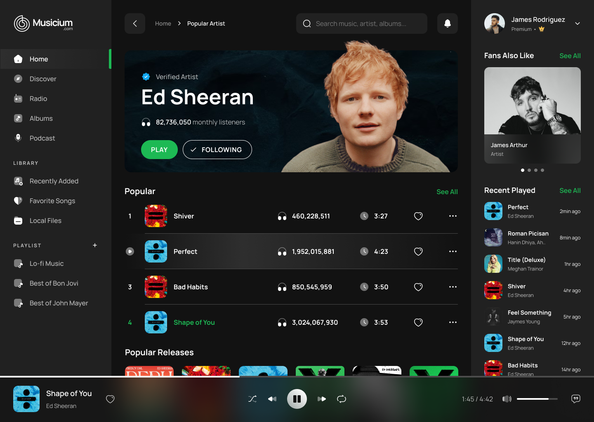

# QR Code Generator



## Introduction

Welcome to music stream app! At this time of writing, it is just an implementation of a [design](https://www.figma.com/file/MF2MReVYOyz5Omw7OC71PB/Music-Stream-Desktop-(Community)?type=design&t=28ph0Sv5A4MLBRcA-6) gotten from figma community and is not yet responsive. Pull requests will be highly welcome 🙂. This README will guide you through the project, helping you set it up and get started.

## Table of Contents

1. [Getting Started](#getting-started)
    - [Prerequisites](#prerequisites)
    - [Installation](#installation)
2. [Contributing](#contributing)
3. [License](#license)

---

## Getting Started

### Prerequisites

Before you begin, ensure you have the following installed on your system:

- Node js 18+
- Your favourite IDE and browser

### Installation

1. Clone the repository:

```bash
git clone https://github.com/Marvellous890/music-stream-app.git
```

2. Navigate to the project directory:

```bash
cd music-stream-app
```

3. Install the required dependencies:

```bash
npm install
```

4. Start the app

```bash
npm run dev
```

## Contributing

I welcome contributions from the community! If you have any ideas for improvements, bug fixes, or new features, feel free to open an issue or submit a pull request.

## License

This project is licensed under the [GNU GPL 3.0](LICENSE).

---

Happy coding! If you have any questions or need further assistance, don't hesitate to reach out.